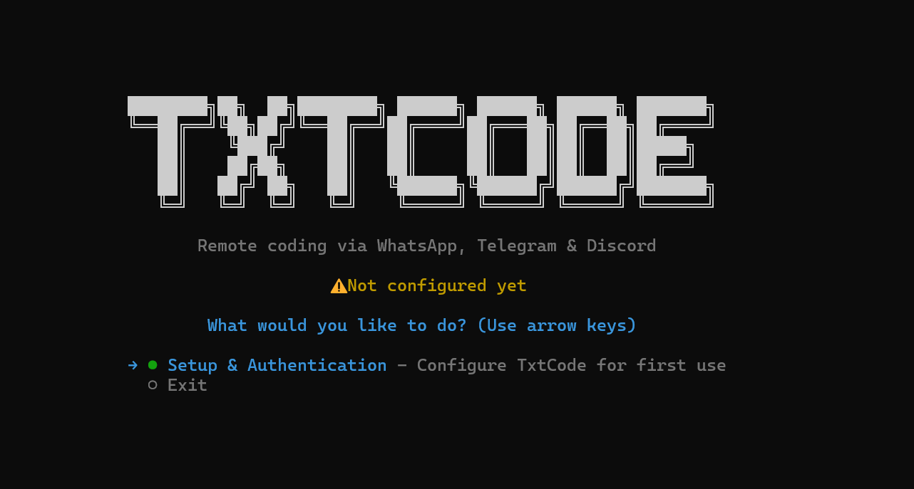

<div align="center">
  

<br />
<br />

<a href="https://www.npmjs.com/package/txtcode"></a>
&nbsp;
<a href="https://www.npmjs.com/package/txtcode"></a>
&nbsp;
<a href="https://github.com/nicholasgriffintn/txtcode/blob/main/LICENSE"></a>
&nbsp;


<br />
<br />

**Code from anywhere. Control your IDE from any messaging app.**

Send a WhatsApp message. Watch your IDE write code.

**txtcode** bridges messaging apps to AI coding assistants, giving you full remote control over your development environment from your phone, tablet, or any device with a chat app.

<br />



</div>

---

## Why txtcode?

You're on the couch, on the train, or away from your desk but you need to fix a bug, run tests, or scaffold a feature. With **txtcode**, your phone becomes a remote control for your IDE:

1. **Text your AI** from WhatsApp, Telegram, Discord, Slack, Teams, or Signal
2. **It writes code** using Claude Code, Cursor, Codex, Gemini CLI, or other adapters
3. **You stay in control** with mode switching, tool calling, and session logs

No port forwarding. No VPN. Just message and code.

---

## Features

<table>
<tr>
<td width="50%">

### Messaging-First

Connect via **6 platforms** : WhatsApp, Telegram, Discord, Slack, Microsoft Teams, and Signal. First user to message is auto-authorized.

### 9 AI Providers

Anthropic, OpenAI, Google Gemini, Mistral, Moonshot, MiniMax, xAI Grok, HuggingFace, and OpenRouter. Hot-switch between them with `/switch`.

### 7 Coding Adapters

Claude Code, Cursor CLI, OpenAI Codex, Gemini CLI, Kiro CLI, OpenCode, and Ollama (local/free). Full IDE control in `/code` mode.

</td>
<td width="50%">

### 9 Built-in Tools

Terminal, process manager, git, file search, HTTP client, environment variables, network diagnostics, cron jobs, and system info all callable by the LLM.

### 13 MCP Servers

Connect GitHub, Brave Search, Puppeteer, PostgreSQL, MongoDB, Redis, Elasticsearch, AWS, GCP, Cloudflare, Vercel, Atlassian, and Supabase as external tools via the Model Context Protocol.

### Session Logging

Per-session logs accessible from the TUI. Follow live, view by index, auto-pruned after 7 days.

</td>
</tr>
</table>

---

## Quick Start

**Requires Node.js 20+ and npm 10+.**

```bash
# Install globally
npm install -g txtcode

# Launch the interactive TUI
txtcode
```

Or run without installing:

```bash
npx txtcode
```

That's it. The interactive menu guides you through everything authentication, configuration, starting the agent, viewing logs, and more. No subcommands to memorize.

---

## Supported Platforms

| Platform            | Transport       | Setup                                                                                   |
| :------------------ | :-------------- | :-------------------------------------------------------------------------------------- |
| **WhatsApp**        | QR code pairing | Scan QR in terminal on first run                                                        |
| **Telegram**        | Bot API         | Create bot via [@BotFather](https://t.me/BotFather), paste token                        |
| **Discord**         | Bot gateway     | Create app at [discord.com/developers](https://discord.com/developers), paste bot token |
| **Slack**           | Socket Mode     | Create app at [api.slack.com](https://api.slack.com/apps), enable Socket Mode           |
| **Microsoft Teams** | Bot Framework   | Register bot at [dev.teams.microsoft.com](https://dev.teams.microsoft.com/bots)         |
| **Signal**          | signal-cli REST | Run [signal-cli-rest-api](https://github.com/bbernhard/signal-cli-rest-api) via Docker  |

---

## AI Providers

txtcode supports **9 LLM providers** for chat mode. Configure one or more during setup and hot-switch with `/switch`.

| Provider            | Example Models                             | Notes                       |
| :------------------ | :----------------------------------------- | :-------------------------- |
| **Anthropic**       | `claude-sonnet-4-6`, `claude-opus-4-6`     | Claude family               |
| **OpenAI**          | `gpt-5.2`, `o4-mini`, `gpt-4o`             | GPT and o-series            |
| **Google Gemini**   | `gemini-2.5-pro`, `gemini-2.5-flash`       | Gemini family               |
| **Mistral**         | `mistral-large-latest`, `codestral-latest` | Mistral + Codestral         |
| **Moonshot (Kimi)** | `kimi-k2.5`, `moonshot-v1-128k`            | Long-context models         |
| **MiniMax**         | `MiniMax-M2.5`, `MiniMax-M2.1`             | MiniMax family              |
| **xAI (Grok)**      | `grok-4`, `grok-3-fast`                    | Grok family                 |
| **HuggingFace**     | _Discovered at runtime_                    | Inference Providers API     |
| **OpenRouter**      | _Discovered at runtime_                    | Unified API for 100+ models |

All providers support tool calling and LLM can invoke any built-in tool or connected MCP server.

---

## Coding Adapters

Use `/code` mode to route messages directly to a coding adapter with full IDE control.

| Adapter                | Backend        | CLI Required | Notes                       |
| :--------------------- | :------------- | :----------- | :-------------------------- |
| **Claude Code**        | Anthropic API  | `claude`     | Official Claude CLI         |
| **Cursor CLI**         | Cursor         | `cursor`     | Headless Cursor             |
| **OpenAI Codex**       | OpenAI API     | `codex`      | OpenAI's coding agent       |
| **Gemini CLI**         | Google AI API  | `gemini`     | Google's CLI                |
| **Kiro CLI**           | AWS            | `kiro-cli`   | AWS Kiro subscription       |
| **OpenCode**           | Multi-provider | `opencode`   | Open-source, multi-provider |
| **Ollama Claude Code** | Local (Ollama) | `ollama`     | Free, no API key needed     |

---

## Built-in Tools

The primary LLM in chat mode has access to **9 built-in tools** that it can call autonomously:

| Tool         | Capabilities                                                                              |
| :----------- | :---------------------------------------------------------------------------------------- |
| **Terminal** | Execute shell commands with timeout and output capture                                    |
| **Process**  | Manage background processes: list, poll, stream logs, kill, send input                    |
| **Git**      | Full git operations (blocks force-push and credential config for safety)                  |
| **Search**   | File and content search across the project                                                |
| **HTTP**     | Make HTTP requests (GET, POST, PUT, DELETE, PATCH, HEAD). Blocks cloud metadata endpoints |
| **Env**      | Get, set, list, and delete environment variables. Masks sensitive values                  |
| **Network**  | Ping, DNS lookup, reachability checks, port scanning                                      |
| **Cron**     | Create, list, and manage cron jobs                                                        |
| **Sysinfo**  | CPU, memory, disk, uptime, OS details                                                     |

---

## MCP Servers

txtcode integrates with the **Model Context Protocol** to connect external tool servers. Configure during initial setup or later via **Configuration** &rarr; **Manage MCP Servers** in the TUI.

### Developer Tools

| Server           | Transport | Description                                   |
| :--------------- | :-------- | :-------------------------------------------- |
| **GitHub**       | stdio     | Repos, issues, PRs, code search, Actions      |
| **Brave Search** | stdio     | Web, image, video, and news search            |
| **Puppeteer**    | stdio     | Browser automation, screenshots, form filling |

### Databases

| Server            | Transport | Description                                    |
| :---------------- | :-------- | :--------------------------------------------- |
| **PostgreSQL**    | stdio     | Read-only SQL queries and schema inspection    |
| **MongoDB**       | stdio     | CRUD, indexes, vector search, Atlas management |
| **Redis**         | stdio     | Data structures, caching, vectors, pub/sub     |
| **Elasticsearch** | stdio     | Index management, search queries, cluster ops  |
| **Supabase**      | HTTP      | Postgres, Auth, Storage, Edge Functions        |

### Cloud

| Server           | Transport | Description                                        |
| :--------------- | :-------- | :------------------------------------------------- |
| **AWS**          | stdio     | S3, Lambda, EKS, CDK, CloudFormation, 60+ services |
| **Google Cloud** | HTTP      | BigQuery, GKE, Compute, Storage, Firebase          |
| **Cloudflare**   | HTTP      | Workers, R2, DNS, Zero Trust, 2500+ endpoints      |
| **Vercel**       | HTTP      | Deployments, domains, env vars, logs               |

### Productivity

| Server        | Transport | Description                                       |
| :------------ | :-------- | :------------------------------------------------ |
| **Atlassian** | HTTP      | Jira issues, Confluence pages, Compass components |

> **stdio** = local process, **HTTP** = remote Streamable HTTP endpoint. You can also add custom MCP servers via **Configuration** &rarr; **Manage MCP Servers**.

---

## Chat Commands

Send these commands in any messaging app while connected:

| Command      | Description                                                                    |
| :----------- | :----------------------------------------------------------------------------- |
| `/chat`      | Switch to **Chat mode** to send messages to primary LLM with tools _(default)_ |
| `/code`      | Switch to **Code mode** to send messages to coding adapter (full IDE control)  |
| `/switch`    | Switch primary LLM provider or coding adapter on the fly                       |
| `/cli-model` | Change the model used by the current coding adapter                            |
| `/cancel`    | Cancel the currently running command                                           |
| `/status`    | Show adapter connection and current configuration                              |
| `/help`      | Show available commands                                                        |

---

## Configuration

Config is stored at **`~/.txtcode/config.json`**. API keys and tokens are stored in your OS keychain (via `keytar`), never in the config file.

To modify settings, select **Configuration** from the main menu. Options include:

- Change Messaging Platform
- Change IDE Type
- Change AI Provider
- Manage MCP Servers (add/remove/enable/disable)
- Change Project Path
- View Current Config

---

## Logs

- **Location:** `~/.txtcode/logs/`
- **Format:** `session-YYYY-MM-DD-HHmmss.log` (one per agent session)
- **Cleanup:** Files older than 7 days are pruned automatically
- **View:** Select **View Logs** from the main menu to browse, view by index, or follow live

Verbose and debug output goes to the log file; the terminal shows only key status lines.

---

## Troubleshooting

<details>
<summary><b>Command not found: txtcode</b></summary>

- Restart your terminal after `npm install -g txtcode`
- Ensure the global bin directory is in your PATH: `npm config get prefix`

</details>

<details>
<summary><b>WhatsApp QR / connection issues</b></summary>

- Use a stable internet connection
- Select **Logout** from the main menu, then **Start Agent** again to get a fresh QR
- Session is stored under `~/.txtcode`; don't delete it to keep the same linked device

</details>

<details>
<summary><b>Telegram / Discord / Slack not responding</b></summary>

- Confirm bot token via **Configuration** &rarr; **View Current Config**
- **Telegram:** ensure the bot is not blocked and you've started a chat with it
- **Discord:** ensure MESSAGE CONTENT INTENT is enabled in the developer portal
- **Slack:** ensure Socket Mode is enabled and event subscriptions are configured

</details>

<details>
<summary><b>AI or adapter errors</b></summary>

- Check API keys and credits for your provider
- Code mode: ensure the CLI for your adapter is installed and in PATH (`claude`, `codex`, `gemini`, `kiro-cli`, `ollama`, `cursor`, `opencode`)
- Check adapter and connection state via the main menu
- Select **View Logs** or check `~/.txtcode/logs/` for detailed errors

</details>

<details>
<summary><b>MCP server connection failures</b></summary>

- **stdio servers:** ensure the required npm package is installed (e.g. `npx @modelcontextprotocol/server-github`)
- **HTTP servers:** verify the token is correct via **Configuration** &rarr; **Manage MCP Servers**
- Check **View Logs** for specific error messages

</details>

---

## License

Apache-2.0
